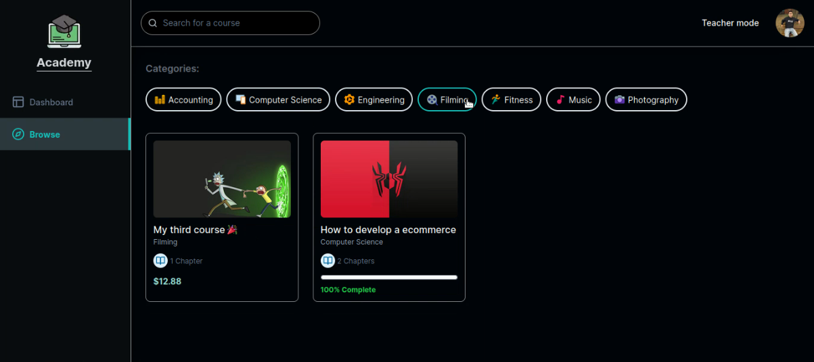

# Academy LMS 🎓

Web application to manage and sell courses, offering a service similar to Udemy, where users can get courses online to view them whenever you want.

<br/>



<br/>

## Main features of this app. 🧐

<br/>

- Login/Sign up with credentials
- Login with providers such as Google or Github

**TEACHER**

- Manage courses
  - Create course
  - Delete course
  - Edit course
    - Change video privacy
    - Change details such as title, description or photo
    - Change price
    - Delete/Edit course chapters
- View analytics of your course sales

**STUDENT**

- View number of courses in progress or completed
- List of courses you have purchased
- Search engine to filter courses of your interest
- Buy a course
- Watch the videos of the course you have purchased.
- View progress bar for each course

<br/>

## Technologies used. 🧪

<br/>

- Next JS 13.
- TypeScript.
- Zustand (State Management).
- Tailwind CSS.
  - Shadcn (component library).
- Clerk (Authentication).
- UploadThing (File storage).
- MUX (Streaming video).
- Prisma (ORM).
- Railway (Deploy data base Postgre SQL).
- Stripe (Manage payments)

<br/>

## Instalation. 🚀

<br/>

### 1. Clone the repository

```bash
 git clone github.com/Franklin361/academy-lms/
```

<br/>

### 2. Run this command to install the dependencies.

```bash
 npm install
```

<br/>

### 3. Create the **.env** file in the root of the project and add the following variables.

```bash

# Clerk config
NEXT_PUBLIC_CLERK_SIGN_IN_URL="/sign-in"
NEXT_PUBLIC_CLERK_SIGN_UP_URL="/sign-up"
NEXT_PUBLIC_CLERK_AFTER_SIGN_IN_URL="/"
NEXT_PUBLIC_CLERK_AFTER_SIGN_UP_URL="/"
NEXT_PUBLIC_CLERK_PUBLISHABLE_KEY=
CLERK_SECRET_KEY=
# You have this id from the Clerk user dashboard, just select a user who will be the TEACHER and copy its ID
NEXT_PUBLIC_TEACHER_ID=

# Database URL
DATABASE_URL=

# Uploadthing
UPLOADTHING_SECRET=
UPLOADTHING_APP_ID=

# Mux
MUX_TOKEN_ID=
MUX_TOKEN_SECRET=

# Stripe
STRIPE_API_KEY=
STRIPE_WEBHOOK_SECRET=
NEXT_PUBLIC_APP_URL=
```

<br/>

### 4. Run this command to create generates the typing related to the prisma scheme.

```bash
 npm run postinstall
```

### 5. Run this command to raise the development server.

```bash
 npm run dev
```

### 6. Important to know ...

If you are going to use Stripe, you should have already set up your account and project.
And as we are in development mode you have to raise your local webhook, running this command:

```bash
  stripe listen --forward-to localhost:3000/api/webhook
```

> It should be noted that you must have **stripe** installed to run that command!

**If you do not do this step, when you want to make the purchase you will get an error.**

<br/>

## Link. ⛓️

<br/>

At the moment there is only this video that shows the live demo, since normally the resources offered by the trial version of each service are exhausted quickly.
[https://youtu.be/oOA8bXLUFNg](https://youtu.be/oOA8bXLUFNg)
